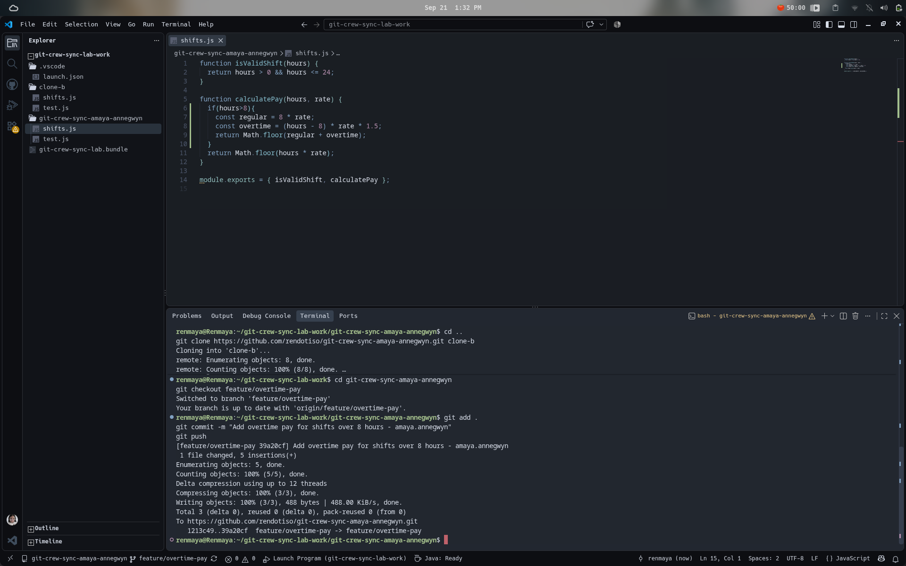
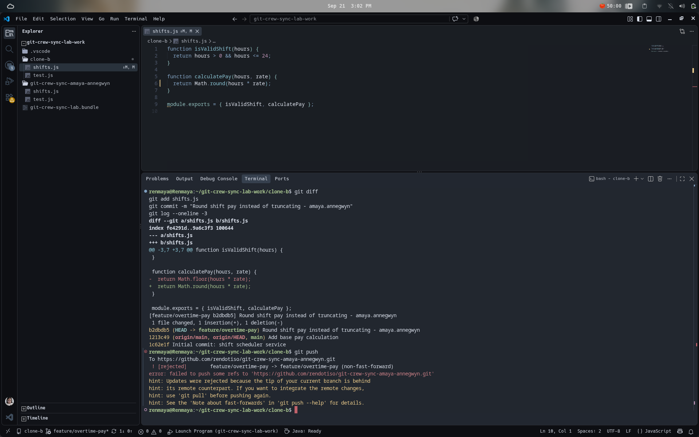
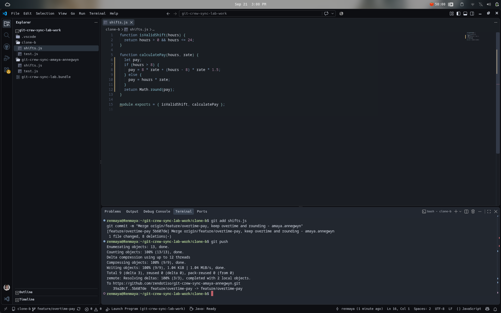
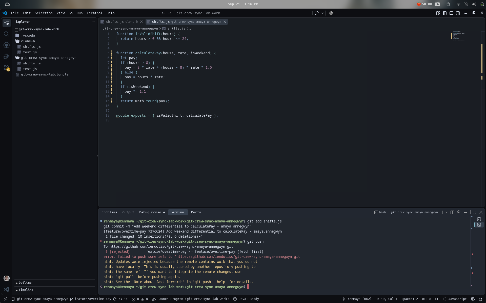
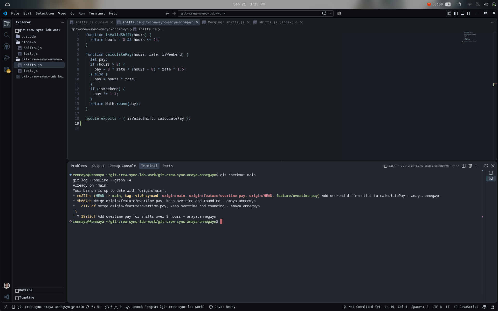
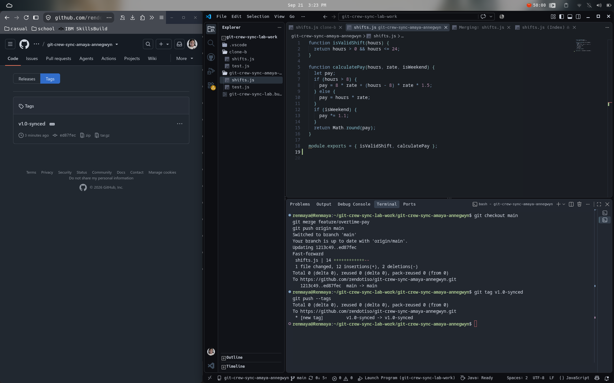

# Git Crew Sync Lab — WORKFLOW.md

## Task 1

## Task 2

## Task 3

## Task 4

## Task 5

## Task 6

---

### 1. What did the rejected push error message tell you, and why did it happen?
The error was caused because another clone had pushed to the same branch so my local branch and `origin/feature/overtime-pay` diverged. Git does not allow overwriting the remote since it would ruin another developer's commit.

### 2. What's the actual difference between how you resolved Task 3 (merge) vs Task 4 (rebase)?
Task 3 uses `git fetch` then `git merge`. This means a merge commit would join two divergent histories. While Task 4 uses `git fetch` then `git rebase`. This means rebase replays my local commit on top of the remote's tip, producing a linear history with no merge commit.

### 3. What one habit would have avoided both rejected pushes in this lab?
Using `git pull` before starting new work and again before pushing, since this would make a clean work rather than constant rejections and divergents.

### 4. Which approach — merge or rebase — would you default to on a shared team branch, and why?
I would use merge as it uses two old commits and preserves everyone's work rather than rebase, which can rewrite commit SHAs which is dangerous on a shared branch.
